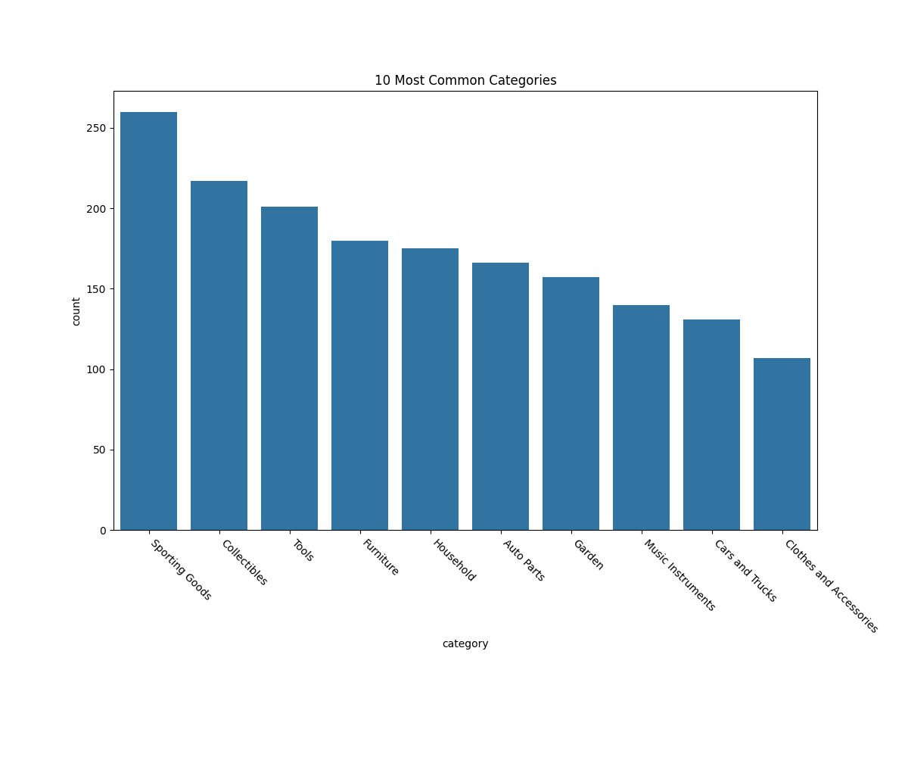

# Visualizations

## 10 Most Common Item Categories

**Why did you pick this representation?**

We chose to use a bar graph to display the 10 most common item categories in descending order because it would best allow us to compare the relative amount of items in each category.

**What alternative ways might you communicate the result?**

Some alternative ways we thought about communicating the results through was a simple table of the category counts. However, we found that such a method would not yield the same visual comparison that the bar graph offers. We also thought about including all categories that were in the dataset, but there would not be enough space to properly and clearly label each category name.

**Were there any challenges visualizing the results, if so, what were they?**

A challenge that we ran into was properly labeling the category names. Firstly, the categories were labelled in abbreviations such as "spo" for Sporting Goods, therefore we had to create a mapping from abbreviation to full category name to label with full names. Secondly, with full names, the names were often too long and would overlap with each other. Therefore, we rotated the x tick labels by 45 degrees.

**Will your visualization require text to provide context or is it standalone (either is fine, but it’s recognized which type your visualization is)?**

This is a stand-alone visualization. The only context we need is that the categories refer to Craigslist second-hand item categories, which is provided by the title.

## Feature Importance based on Linear Regression

**Why did you pick this representation?**

We chose this representation of a scatter plot and half transparent points because we wanted to highlight the clusters of feature types along different levels of feature importances. As visible from the graph, there are clear areas of green and blue, which indicates the general feature importance difference between image and text features.

**What alternative ways might you communicate the result?**

We considered using bar graphs to plot the mean of every feature type, however we felt that this did not give a good representation of the spread of individual features among the feature importance scale. Additionally, bar graphs could not highlight the relative ranking of individual feature importances as a scatter plot can.

**Were there any challenges visualizing the results, if so, what were they?**

One of the challenges was the fact that there were positive and negative coefficients for the linear regression model. At first, when plotting many of the features were on the negative end, which made us realize that even a negative coefficient is contributing important information about the result. Thus, we took the absolute value of every coefficient and ranked importance based on coefficient magnitude.

**Will your visualization require text to provide context or is it standalone (either is fine, but it’s recognized which type your visualization is)?**

This visualization requires text to provide context about the parameters and preprocessing we used to produce our dataset and model with Linear Regression. The text features are the item titles processed with the SpaCy package, specifically the en_core_web_sm word embeddings. The image features are the item images processed with Keras VGG16 model trained on ImageNet, then dimensionality-reduced with PCA to keep 90% of the explainer variance ratio. Otherwise, the webscraped features are original features webscraped directly from Craigslist.
